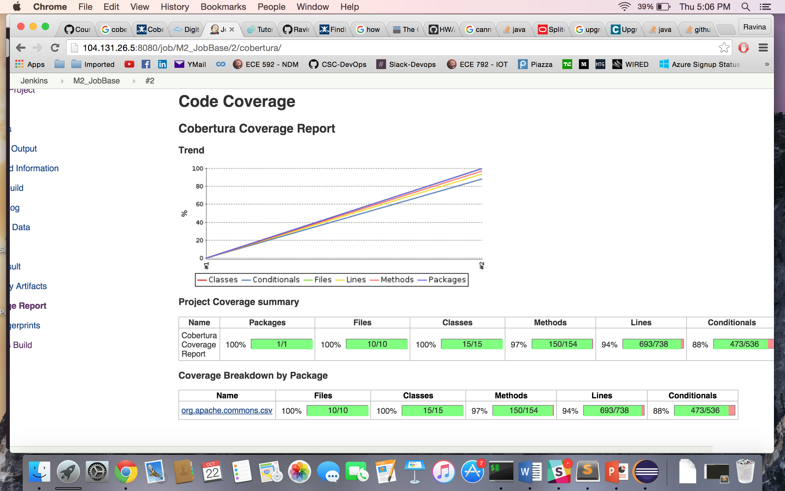

# CSC 591/791 DevOps, Fall 2015

## PROJECT MILESTONE #2

**TEAM:** 
*Kriti Bhandari - kbhanda*
*Rajashree Mandaogane - rsmandao*
*Ravina Dhruve - rrdhruve*

**PROJECT REPO - GitHub Link**
https://github.com/RavinaDhruve/commons-csv/tree/RandoopTest

### TEST + ANALYSIS
We are working with an open-source project of commons-csv library
which we have forked and cloned for the purposes of the project milestone.

**TOOLS**
+ Randoop - It is a constraint-based test case generation tool. We are using it to improve the test coverage for Task 2 of this milestone.
+ Maven - To run the tests generated.
+ Cobertura - To generate test report on Jenkins server.

We have imported the project in eclipse and have installed junit.jar and
hamcrest.jar to be able to use randoop and maven.

### TEST SECTION
**TASKS**

+ Task 1: Unit Tests and Coverage
- On local machine:
```
Edit pom.xml of the repo to include cobertura plugin for coverage report generation.
Running mvn test 
Running git commit and push
```

This triggers a build on jenkins. If build succeeds, coverage report is generated.

- On Jenkins:
```
On the machine running Jenkins, install git, maven and openjdk1.8
Install plugins: git, maven-integration, cobertura and findbugs

Create a Job: BaseJob with respective configurations
(Note: config.xml file included in this repo)
(Note: In the job, make sure to include cobertura:cobertura as part of build.)

Also, we need to do:
Manage Jenkins-> Configure systems -> maven installations -> add “maven 3.0.3”
```

Screenshot:



+ Task 2: Advanced Testing Technique: Using Randoop
- On local machine:
```
Edit pom.xml of the repo to include the following: 
- Add randoop dependency
- Edit the maven-surefire-plugin to include new test case files
Run Randoop on source files to generate test cases
Running mvn test 
Running git commit and push
```
This triggers a build on jenkins. If build succeeds, coverage report is generated.

- On Jenkins:
```
Create a Job: RandoopJob with respective configurations
(Note: config.xml file included in this repo)
(Note: In the job, make sure to include cobertura:cobertura as part of build.)
```

Screenshot:


### ANALYSIS SECTION
+ Task 3: Base Analysis:
We are using Findbugs to perform static analysis of the code.
```
- Install Findbugs plugin on Jenkins server.
- Edit the pom.xml in the repo to include findbugs plugin.
- In the job, make sure to include findbugs:findbugs as part of build.
```

Screenshot:


+ Task 4: Extended Analysis:
We have written a custom python script which is run on every code file in the repo. This script performs the analysis of finding the comments:code ratio in each file.
In the job configuration this file is run as a pre-build step and we can see the output on the console.
(Note: test.py is included as part of the repo)


### TEST+ANALYSIS GATE SECTION
+ Task 5: Testing Gate:
In order to check the build against a testing criteria, we are configuring the cobertura settings in the Jenkins job.
```
On Jenkins Dashboard -> In the Job -> Post-build settings -> Fail the build if conditionals test coverage is less than 95%.
```
Whenever the build fails, an email notification is sent.
Note: We have verified for both build success and failure based on the threshold set.


+ Task 6: Analysis Gate:
- In order to check the build against an analysis criteria, we are failing the build if any code violates the pre-defined comment:code ratio.
This is done by the python script we wrote for extended analysis (test.py)

- In order to check the build against an analysis criteria, we are configuring the Findbugs settings in the Jenkins job.
```
On Jenkins Dashboard -> In the Job -> Post-build settings -> Fail the build if number of warnings is greater than 1.
```
Whenever the build fails, an email notification is sent.
Note: We have verified for both build success and failure based on the threshold set.


+ Security Token Gate:
For this, we have written python scripts which will check for a .pem file in the repo and will also check for security and access tokens in the code files.

We are running these scripts via pre-commit hook. If the security gate is violated, the commit is rejected.
In the following screenshots, the 'git status' command shows no change before and after the 'git commit' command, because our pre-commit hook rejected the commit due to violation of security gate.


**Notes:**
We have also added email notification as post-build to notify the user whenever build fails (as well as when it succeeds).

To avoid sudo warning: Add in jenkins /etc/sudoers: 
%jenkins ALL=NOPASSWD: ALL

While creating different jobs for different branches, add the corresponding branch name
after GIT repo URL.


**SCREENCAST LINK:**


Tool used: QuickTime Player
___


**File Description:**

+ README.md - this current file.
+ config.xml - Configuration files of the Jenkins jobs
+ test.py, token.py and checkfiles.py - these files are scripts for Extended analysis and Security Gate tasks.
